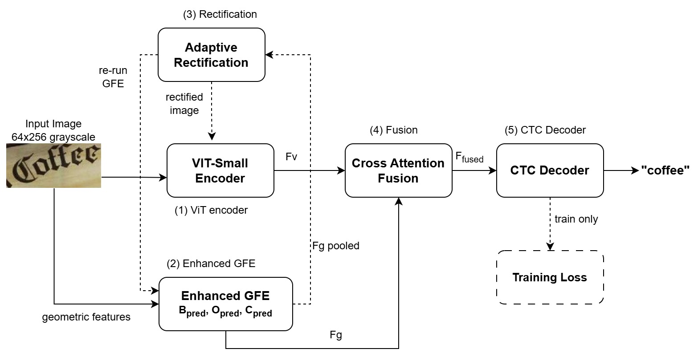

# PARSeq-GeoAware

**Explicit Geometric Modeling for Robust Scene Text Recognition in the Wild**

*Shilpi Goyal · Deepak Motwani — Amity University, Gwalior, India*


PARSeq-GeoAware is a dual-branch scene text recognition framework that combines a Vision Transformer encoder with an **Enhanced Geometric Feature Extractor (GFE)**, adaptive coarse-to-fine rectification (affine + TPS), and a cross-attention fusion module decoded by a CTC head. Trained on 176,630 image-label pairs across three progressive stages, it achieves strong performance on both regular and irregular/curved text benchmarks — without a language model.
---

# Overall Architecture


---

## Results

### Word Accuracy (%) — Stage 3 checkpoint, epoch 24

| Dataset | Type | N | WA (%) | ±1 Acc (%) | ±2 Acc (%) | CER (%) | NED |
|---------|------|--:|-------:|-----------:|-----------:|--------:|----:|
| IIIT5K | Regular | 3,000 | **89.87** | 96.43 | 98.43 | 3.38 | 0.9724 |
| SVT | Regular | 647 | **82.07** | 94.13 | 98.61 | 4.37 | 0.9534 |
| ICDAR13 | Regular | 1,081 | **84.55** | 93.34 | 97.13 | 5.31 | 0.9370 |
| ICDAR15 | Incidental | 2,077 | **68.90** | 83.73 | 91.33 | 12.83 | 0.8787 |
| ArT | Irregular | 5,327 | **71.26** | 84.10 | 90.31 | 13.98 | 0.8760 |
| Total-Text | Curved | 2,210 | **81.27** | 90.05 | 92.99 | 9.05 | 0.9246 |
| **Avg Regular** | | | **85.50** | 94.63 | 98.06 | 4.35 | 0.9543 |
| **Avg Irr./Curved** | | | **73.81** | 85.96 | 91.55 | 11.95 | 0.8931 |

> ±1 accuracy on curved benchmarks exceeds PARSeq's published word accuracy:
> **84.10%** vs 79.3% on ArT (+4.80 pp) · **90.05%** vs 87.1% on Total-Text (+2.95 pp)

### Inference Latency — Tesla T4 (batch=1, FP32, 100 warmup + 500 timed runs)

| Configuration | Mean (ms) | FPS | vs DAN |
|---------------|----------:|----:|-------:|
| ViT+CTC only (baseline) | 5.5 ± 0.7 | 183 | 14.2× |
| + GFE | 8.1 ± 1.0 | 123 | 9.6× |
| + GFE + Fusion | 8.9 ± 2.0 | 112 | 8.8× |
| **Full model (affine + TPS) ★** | **11.9 ± 1.4** | **84** | **6.5×** |

---

## Repository Structure

```
PARSeq-GeoAware/
├── models/
│   └── model.py          # PARSeqGeoAware, set_charset, improved_ctc_decode, CHARSET
├── utils/
│   ├── dataset.py        # Dataset loaders
│   └── metrics.py        # WA / ±1 / CER / NED
├── configs/
│   └── default.yaml      # Hyperparameters
├── datasets.py           # build_stage1 / build_stage2 / build_stage3
├── train.py              # Progressive 3-stage training script
├── evaluate.py           # Evaluation script
├── demo.py               # Single-image and batch inference
├── requirements.txt      # Python dependencies
└── README.md
```

---

## Quick Start

### Option A — Google Colab (recommended, no local setup needed)

Open the Colab notebook and run all cells top-to-bottom:

[](https://colab.research.google.com/github/Arni-123/PARSeq-GeoAware/blob/main/PARSeq_GeoAware_Test.ipynb)

> Set runtime to **T4 GPU** before running: `Runtime → Change runtime type → T4 GPU`

The notebook covers:
- Single image inference
- Batch inference (upload or Google Drive folder)
- Full dataset evaluation with WA / ±1 / CER / NED metrics
- Ablation (disable components, measure accuracy drop)
- Inference timing (replicates Table 4)

### Option B — Local installation

```bash
git clone https://github.com/Arni-123/PARSeq-GeoAware.git
cd PARSeq-GeoAware
pip install -r requirements.txt
```

---

## Pretrained Checkpoint

Download the Stage 3 checkpoint (335.5 MB) trained on ArT + Total-Text + IIIT5K anchor:

```bash
# Using gdown
pip install gdown
gdown 1G6OBZN9h9FXj5iK_JckXAKvmacc1cI5T -O checkpoints/stage3_best.pth

# Or direct link
# https://drive.google.com/file/d/1G6OBZN9h9FXj5iK_JckXAKvmacc1cI5T/view
```

Checkpoint metadata:

```
stage          : 3
epoch          : 24
ctc_loss       : (best on ArT + Total-Text)
charset        : 36  (0-9, a-z)
use_geometric  : True
use_rect       : True
use_tps        : True
num_chars      : 37  (36 chars + 1 CTC blank)
```

Architecture confirmed from checkpoint keys (281 tensors):

| Prefix | Component | Tensors |
|--------|-----------|--------:|
| `encoder.*` | ViT-Small, 16×16 patches, pos_embed [1,65,384] | ~150 |
| `gfe.*` | 4-stage ResNet + boundary/orientation/curvature heads + geo_attention | 31 |
| `fusion.*` | Cross-attention + gate_proj + layer_norm | 14 |
| `rectification.*` | affine_mlp + tps_mlp + ctrl_pts [8,2] | 13 |
| `head.*` | Linear(384→37) CTC classifier | 2 |

---

## Inference

### Single image

```bash
python demo.py \
    --checkpoint checkpoints/stage3_best.pth \
    --image      path/to/word_crop.jpg \
    --charset    36
```

### Folder / batch

```bash
python demo.py \
    --checkpoint   checkpoints/stage3_best.pth \
    --image_folder path/to/images/ \
    --output       predictions.txt \
    --charset      36 \
    --visualise
```

Output format (`predictions.txt`): one `image_path\tprediction` per line.

### Python API

```python
import torch
import torchvision.transforms as TF
from PIL import Image
from models.model import PARSeqGeoAware, set_charset, CHARSET, improved_ctc_decode

# Setup
set_charset(36)
device = torch.device('cuda' if torch.cuda.is_available() else 'cpu')

# Load model from checkpoint
ckpt       = torch.load('checkpoints/stage3_best.pth', map_location=device)
cfg        = ckpt.get('config', {})
model      = PARSeqGeoAware(
    num_chars         = cfg.get('num_chars', len(CHARSET) + 1),
    use_geometric     = cfg.get('use_geometric',     True),
    use_rectification = cfg.get('use_rectification', True),
    use_tps           = cfg.get('use_tps',           True),
).to(device)
model.load_state_dict(ckpt['model_state_dict'], strict=False)
model.eval()

# Preprocess — must match training transform exactly
transform = TF.Compose([
    TF.Resize((64, 256)),
    TF.Grayscale(1),
    TF.ToTensor(),
    TF.Normalize(mean=[0.5], std=[0.5]),
])

# Predict
img        = Image.open('word_crop.jpg').convert('RGB')
tensor     = transform(img).unsqueeze(0).to(device)      # (1, 1, 64, 256)

with torch.no_grad():
    log_probs, _ = model(tensor, return_features=True)   # (T, B, C)
    log_probs    = log_probs.log_softmax(2)
    prediction   = improved_ctc_decode(log_probs)[0]

print(prediction)   # e.g. "chicken"
```

---

## Evaluation

Evaluate on any ground-truth `.txt` file (tab-separated: `image_path\tlabel`):

```bash
python evaluate.py \
    --checkpoint checkpoints/stage3_best.pth \
    --gt_txt     data/test/art_test_gt.txt \
    --charset    36
```

Output includes WA, ±1 accuracy, ±2 accuracy, CER, and NED.

### Reproduce paper results (multi-dataset)

Run the Colab notebook Step 13, or locally:

```bash
for GT in data/test/iiit5k_test.txt \
           data/test/svt_test.txt \
           data/test/icdar13_test.txt \
           data/test/icdar15_test.txt \
           data/test/art_test_gt.txt \
           data/test/totaltext_test_gt.txt; do
    echo "--- $GT ---"
    python evaluate.py \
        --checkpoint checkpoints/stage3_best.pth \
        --gt_txt     $GT \
        --charset    36
done
```

---

## Training

### Prerequisites — download datasets

| Dataset | Split used | Link |
|---------|-----------|------|
| MJSynth | 134,828 samples (Stage 1) | [Oxford VGG](http://www.robots.ox.ac.uk/~vgg/data/text/) |
| IIIT5K | train 2,000 / test 3,000 | [CVIT](https://cvit.iiit.ac.in/research/projects/cvit-projects/the-iiit-5k-word-dataset) |
| ArT | train 30,520 / test 5,388 | [ICDAR 2019 RRC](https://rrc.cvc.uab.es/?ch=14) |
| Total-Text | train 9,282 / test 2,211 | [GitHub](https://github.com/cs-chan/Total-Text-Dataset) |
| SVT | test 647 | [Kaggle](https://www.kaggle.com/datasets/nageshsingh/the-street-view-text-dataset) |
| ICDAR13 | test 1,081 | [RRC](https://rrc.cvc.uab.es/?ch=2) |
| ICDAR15 | test 2,077 | [RRC](https://rrc.cvc.uab.es/?ch=4) |

GT files are tab-separated: `image_path\tlabel` (one per line).

### Full 3-stage training

```bash
python train.py \
    --stage         all \
    --no_pretrained \
    --charset       36 \
    --iiit5k_in_stage3 \
    --mjsynth_txt   data/train/mjsynth_path_label.txt \
    --iiit5k_train  data/train/iiit5k_train.txt \
    --art_txt       data/train/art_train.txt \
    --totaltext_txt data/train/totaltext_train_gt.txt \
    --batch_size    8 \
    --accum_steps   4 \
    --epochs_s1     12 \
    --epochs_s2     12 \
    --epochs_s3     25 \
    --lr_s1         1e-4 \
    --lr_s2         5e-5 \
    --lr_s3         2e-5 \
    --save_dir      checkpoints \
    --save_every    500
```

Effective batch size: 8 × 4 = **32**. Full training takes 18–24 hours on a single Tesla T4.

### Training stages

| Stage | Data | Epochs | LR | Key settings |
|-------|------|-------:|---:|-------------|
| 1 | MJSynth + IIIT5K | 12 | 1e-4 | GFE + ViT; rectification OFF; ViT frozen for first 3 epochs |
| 2 | IIIT5K + ArT (step-level interleaved) | 12 | 5e-5 | Affine rectification ON; λ_geo=0.03 |
| 3 | ArT + Total-Text + IIIT5K anchor | 25 | 2e-5 | Full model (affine + TPS); λ_geo=0.0; strong augmentation |

### Individual stages

```bash
# Stage 1 only
python train.py --stage 1 --mjsynth_txt data/train/mjsynth_path_label.txt \
    --iiit5k_train data/train/iiit5k_train.txt --save_dir checkpoints

# Stage 2 only (loads stage1_best.pth automatically)
python train.py --stage 2 --iiit5k_train data/train/iiit5k_train.txt \
    --art_txt data/train/art_train.txt --save_dir checkpoints

# Stage 3 only (loads stage2_best.pth automatically)
python train.py --stage 3 --art_txt data/train/art_train.txt \
    --totaltext_txt data/train/totaltext_train_gt.txt \
    --iiit5k_train data/train/iiit5k_train.txt --iiit5k_in_stage3 \
    --save_dir checkpoints
```

### Resume from checkpoint

```bash
python train.py --stage 3 --resume checkpoints/stage3_best.pth [other args...]
```

### Smoke test (no real data needed)

```bash
python train.py --smoke_test --stage 1 --epochs_s1 2 --batch_size 4
```

---

## Ablation

Disable components at inference time to replicate Table 9:

```python
# ViT+CTC baseline (no GFE, no fusion, no rectification)
model.use_geometric     = False
model.use_rectification = False
model.use_tps           = False

# +GFE only
model.use_geometric     = True
model.use_rectification = False

# Full model
model.use_geometric     = True
model.use_rectification = True
model.use_tps           = True
```

Expected ArT word accuracy:

| Configuration | ArT WA (%) | Δ vs baseline |
|---------------|----------:|--------------:|
| ViT+CTC baseline | 42.89 | — |
| +GFE (no fusion) | 70.23 | +27.34 pp |
| +GFE + Fusion | 70.23 | +27.34 pp |
| +GFE + Fusion + Affine | 71.26 | +28.37 pp |
| **Full model (aff+TPS) ★** | **71.15** | **+28.26 pp** |

> The GFE alone provides 96.4% of the total improvement — explicit geometric
> feature learning dominates spatial transformation by 27:1 in marginal gain.

---

## Requirements

```
torch>=2.0.0
torchvision>=0.15.0
timm>=0.9.0
Pillow
scipy
tqdm
matplotlib
editdistance
gdown
opencv-python-headless
pyyaml
```

Install:

```bash
pip install -r requirements.txt
```

Tested on: Python 3.10 · PyTorch 2.0.0 · CUDA 11.8 · Tesla T4 (Google Colab)

---

## Troubleshooting

| Error | Cause | Fix |
|-------|-------|-----|
| `ImportError: set_charset` | Symbol missing in model.py | Confirm `models/model.py` is complete |
| `ValueError: too many values to unpack` | Old demo.py unpacks model output | Use `log_probs, _ = model(img, return_features=True)` |
| `unexpected keys` warnings | Minor arch mismatch | Safe with `strict=False` unless accuracy is wrong |
| `gdown` download fails | Drive confirmation page | Download manually → upload to `checkpoints/stage3_best.pth` |
| Empty / garbled prediction | Image not a tight word crop | Crop to just the word region; remove whitespace borders |
| `CUDA out of memory` | GPU memory exceeded | Use `--device cpu` in demo.py, or reduce batch size |
| NaN training loss | CTC constraint violated | Ensure `2 * label_len + 1 ≤ T` — labels longer than 32 chars are filtered |
| HuggingFace rate limit warning | Unauthenticated HF Hub access | `export HF_TOKEN=your_token_here` |

---

## Citation

If you use this code or the pretrained model, please cite:

```bibtex
@article{goyal2026parseqgeoaware,
  title   = {PARSeq-GeoAware: Explicit Geometric Modeling for Robust Scene
             Text Recognition in the Wild},
  author  = {Goyal, Shilpi and Motwani, Deepak},
  year    = {2026},
  note    = {Received: 26 January 2026; Revised: 16 March 2026}
}
```

---

## License

This project is released for research and academic use.
Training datasets (MJSynth, IIIT5K, ArT, Total-Text, SVT, ICDAR13, ICDAR15)
are subject to their respective original licenses.

---

## Acknowledgements

We thank the authors of
[PARSeq](https://github.com/baudm/parseq),
[timm](https://github.com/huggingface/pytorch-image-models), and
[RARE](https://github.com/bgshih/aster)
whose architectures and codebases informed this work.
